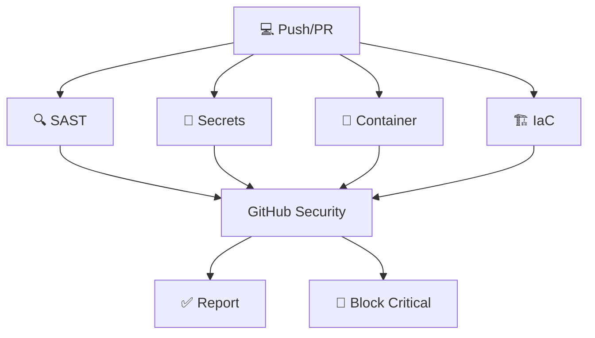

# 🛡️ Esteira de Segurança Automatizada - DevSecOps

<div align="center">


**Uma implementação completa de DevSecOps com análise automatizada de segurança**

[📖 Documentação](#-documentação) • [🔒 Segurança](#-ferramentas-de-segurança) • [📊 Pipeline](#-pipeline-de-segurança) • [📈 Relatórios](#-relatórios-e-monitoramento)

</div>

---

## 🎯 **Visão Geral**

Este projeto demonstra uma implementação **robusta e completa** de **DevSecOps** utilizando **GitHub Actions** para automatizar análises de segurança em todas as fases do desenvolvimento. A aplicação de exemplo é uma **API RESTful** construída em **Python/Flask** com foco em práticas de segurança modernas.

### 🏆 **Destaques do Projeto**

- 🔍 **6 ferramentas de segurança** automatizadas (2 SAST + SCA + Secrets + 2 Container/IaC)
- 🚀 **Integração nativa** com GitHub Security
- 🐳 **Container security** com Trivy
- 📦 **Dependências monitoradas** via Dependabot
- 🔐 **Zero secrets** no código-fonte
- ⚡ **Feedback imediato** em Pull Requests

---

## 🎯 **Estratégia DevSecOps**

### 🔄 **Shift-Left Security**
- **Análise contínua** desde o primeiro commit
- **Feedback imediato** em Pull Requests
- **Bloqueio automático** para vulnerabilidades críticas
- **Integração nativa** com ferramentas de desenvolvimento

### 🛡️ **Defesa em Camadas**
- **Múltiplas camadas** de análise de segurança
- **Diferentes perspectivas** (código, dependências, containers, IaC)
- **Redundância inteligente** (Semgrep + CodeQL para SAST)
- **Cobertura completa** do ciclo de desenvolvimento

---

## 🛠️ **Ferramentas de Segurança**

### 🔍 **SAST (Static Application Security Testing)**

#### Semgrep - Análise Rápida e Específica
```yaml
🟢 Semgrep v1.0
├── 📋 p/security-audit     # Auditoria geral de segurança
├── 🔐 p/secrets           # Detecção de credenciais
├── 🎯 p/owasp-top-ten     # Top 10 OWASP
├── 🐍 p/python            # Específico para Python
├── 🌐 p/flask             # Framework Flask
├── 💾 p/sql-injection     # Prevenção SQL Injection
└── ⚡ p/command-injection  # Prevenção Command Injection
```

#### CodeQL - Análise Semântica Profunda
```yaml
🟢 GitHub CodeQL
├── 🧠 Semantic analysis    # Análise semântica do código
├── 🔍 Data flow tracking  # Rastreamento de fluxo de dados
├── 🎯 Security queries    # Queries de segurança específicas
└── 🐍 Python coverage     # Cobertura Python nativa
```

### 📦 **SCA (Software Composition Analysis)**
```yaml
🟢 Dependabot
├── 🐍 Python packages      # requirements.txt
├── 🐳 Docker images       # Dockerfile
└── ⚙️ GitHub Actions      # workflows
```

### 🔐 **Secrets Scanning**
```yaml
🟢 Gitleaks v8.0
├── 🔍 API keys detection
├── 🔑 SSH keys scanning
├── 🎫 JWT tokens analysis
└── 📄 Certificate validation
```

### 🐳 **Container Security**
```yaml
🟢 Trivy Scanner
├── 🔍 Image vulnerabilities
├── 📦 Package scanning
├── 🐧 OS vulnerabilities
└── 📋 Configuration issues
```

### 🏗️ **IaC Security**
```yaml
🟢 Trivy Config
├── 🐳 Dockerfile analysis
├── ⚙️ Kubernetes configs
├── 🔧 YAML configurations
└── 🛡️ Security policies
```

---

## 🔒 **Pipeline de Segurança**

### 📊 **Fluxo Automatizado**



### ⚙️ **Configuração dos Workflows**

| Workflow | Trigger | Duração | Status |
|----------|---------|---------|---------|
| **Security Scan** | Push/PR | ~3-5min | ✅ Ativo |
| **Dependabot** | Semanal | ~1min | ✅ Ativo |
| **Container Build** | Push/PR | ~2-4min | ✅ Ativo |

### 🎯 **Triggers Automáticos**

- 📤 **Push para `main`**: Análise completa
- 🔄 **Pull Requests**: Verificação delta
- 📅 **Agendado**: Scan semanal completo
- 🚨 **Dependências**: Atualizações automáticas

---

## 📊 **Relatórios e Monitoramento**

### 🎯 **GitHub Security Tab**
Todos os resultados são centralizados em:
- **Security Overview** → Visão geral
- **Code Scanning** → Análise SAST
- **Dependabot** → Vulnerabilidades de dependências
- **Secret Scanning** → Credenciais expostas

### 🚨 **Alertas e Notificações**

- ⚡ **Feedback imediato** em PRs
- 📧 **Emails automáticos** para vulnerabilidades críticas
- 🔔 **Notificações GitHub** em tempo real
- 📊 **Dashboards** integrados

---

## 📋 **Como Utilizar a Esteira de Segurança**

### 🎯 **Para Desenvolvedores - Guia Rápido**

#### 1️⃣ **Primeiro Setup**
```bash
# Clone o repositório
git clone https://github.com/jmessiass/devsecops.git
cd devsecops

# Crie uma branch para seu trabalho
git checkout -b feature/minha-feature

# Faça suas alterações
# ...

# Commit e push
git add .
git commit -m "feat: minha nova feature"
git push origin feature/minha-feature
```

#### 2️⃣ **Criar Pull Request**
1. 🔄 Abra um **Pull Request** no GitHub
2. ⏱️ Aguarde **3-5 minutos** para a análise completa
3. 📊 Verifique os **resultados** na aba "Checks"
4. 🔍 Corrija possíveis **vulnerabilidades** encontradas

#### 3️⃣ **Interpretar Resultados**

| Status | Significado | Ação |
|--------|-------------|------|
| ✅ **All checks passed** | Sem vulnerabilidades | ✅ Pode fazer merge |
| ⚠️ **Some checks failed** | Vulnerabilidades baixas/médias | 🔍 Revisar e corrigir |
| ❌ **Critical issues** | Vulnerabilidades críticas | 🚨 **Bloqueado** - Corrija antes do merge |

### ⚙️ **Configuração GitHub Advanced Security**

#### 🔧 **Habilitando as Funcionalidades**

**Para repositórios privados** (requer GitHub Advanced Security):

1. **Vá para Settings → Security & analysis**
2. **Habilite as seguintes opções:**

```yaml
✅ Dependency graph
✅ Dependabot alerts  
✅ Dependabot security updates
✅ Code scanning (CodeQL)
✅ Secret scanning
✅ Secret scanning push protection
```

#### 🎯 **CodeQL Configuration**
```yaml
# .github/workflows/codeql.yml (GitHub cria automaticamente)
name: "CodeQL"
on:
  push:
    branches: [ main ]
  pull_request:
    branches: [ main ]
  schedule:
    - cron: '0 8 * * 1'  # Segunda-feira 8h

jobs:
  analyze:
    runs-on: ubuntu-latest
    strategy:
      matrix:
        language: [ 'python' ]
```

#### 🔐 **Secret Scanning Rules**
O GitHub detecta automaticamente:
- 🔑 API Keys (AWS, Google, etc.)
- 🎫 Tokens (JWT, OAuth, etc.)
- 🔐 Database URLs
- 📧 Email credentials
- 🔒 Certificates

### 🛠️ **Executando Localmente**

#### 🔍 **Semgrep (SAST)**
```bash
# Instalar Semgrep
pip install semgrep

# Executar análise completa
semgrep --config=p/security-audit \
        --config=p/secrets \
        --config=p/owasp-top-ten \
        --config=p/python \
        --config=p/flask \
        --sarif --output=semgrep.sarif .

# Executar análise rápida
semgrep --config=auto .
```

#### 🔐 **Gitleaks (Secrets)**
```bash
# Instalar Gitleaks
brew install gitleaks  # macOS
# ou
go install github.com/gitleaks/gitleaks/v8@latest

# Scan do repositório completo
gitleaks detect --source . --verbose

# Scan apenas dos novos commits
gitleaks protect --verbose
```

#### 🐳 **Trivy (Container + IaC)**
```bash
# Instalar Trivy
brew install trivy  # macOS
# ou
curl -sfL https://raw.githubusercontent.com/aquasecurity/trivy/main/contrib/install.sh | sh -s -- -b /usr/local/bin

# Scan da imagem Docker
docker build -t devsecops-app .
trivy image devsecops-app

# Scan do filesystem
trivy fs .

# Scan de configurações (IaC)
trivy config .

# Gerar relatório SARIF
trivy image --format sarif --output results.sarif devsecops-app
```

#### 📦 **Dependabot (Local Alternative)**
```bash
# Safety - Verificação de dependências Python
pip install safety
safety check

# Pip-audit - Auditoria de dependências
pip install pip-audit
pip-audit

# Verificar dependências desatualizadas
pip list --outdated
```

### 📊 **Acessando Resultados no GitHub**

#### 🎯 **GitHub Security Tab**
1. **Navegue para:** `https://github.com/seu-usuario/seu-repo/security`
2. **Seções disponíveis:**
   - 📊 **Overview** - Resumo geral
   - 🔍 **Code scanning** - Resultados SAST
   - 📦 **Dependabot** - Vulnerabilidades de dependências  
   - 🔐 **Secret scanning** - Credenciais expostas

#### 📈 **Pull Request Checks**
```yaml
📋 Security Scan Status:
├── ✅ SAST (Semgrep)           # ~2 min
├── ✅ Secrets (Gitleaks)       # ~30 sec  
├── ✅ Container (Trivy)        # ~3 min
├── ✅ IaC (Trivy Config)       # ~1 min
└── ✅ Dependencies (Dependabot) # ~1 min
```

#### 🚨 **Tratamento de Alertas**

**Vulnerabilidades Críticas/Altas:**
1. 🔍 **Analise** o alerta detalhadamente
2. 🛠️ **Implemente** a correção sugerida
3. ✅ **Teste** a solução localmente
4. 📤 **Commit** e push da correção
5. ✔️ **Verifique** se o alerta foi resolvido

**False Positives:**
```yaml
# Para Semgrep - .semgrepignore
# Ignorar arquivo específico
path/to/file.py

# Ignorar regra específica
# semgrep:ignore python.flask.security.audit.app-run-debug-true
app.run(debug=True)  # Apenas em desenvolvimento
```

### 🔧 **Customização Avançada**

#### ⚙️ **Configurar Severidade Mínima**
```yaml
# .github/workflows/security.yml
- name: Run Semgrep
  uses: returntocorp/semgrep-action@v1
  with:
    config: p/security-audit
    generateBaseline: true
  env:
    SEMGREP_RULES: |
      rules:
        - id: custom-rule
          severity: ERROR  # INFO, WARNING, ERROR
```

#### 🎯 **Custom Semgrep Rules**
```yaml
# .semgrep.yml
rules:
  - id: flask-debug-true
    message: Flask debug mode enabled in production
    languages: [python]
    severity: ERROR
    pattern: app.run(debug=True)
    paths:
      include:
        - "*.py"
      exclude:
        - "tests/"
```

#### 🔐 **Gitleaks Configuration**
```toml
# .gitleaks.toml
[allowlist]
description = "Allowlist configuration"
files = [
    "^.gitleaks.toml$",
    "(.*?)(jpg|gif|doc|pdf|bin)$"
]
regexes = [
    "example@email.com",  # Email de exemplo
]
```

---

## 📚 **Documentação**

### 📖 **Configurações de Segurança**
- [⚙️ .github/workflows/security.yml](/.github/workflows/security.yml) - Pipeline de segurança
- [🛡️ .github/dependabot.yml](/.github/dependabot.yml) - Configuração Dependabot

### 🎓 **Recursos de Aprendizado**
- [📚 OWASP DevSecOps Guidelines](https://github.com/OWASP/DevSecOpsGuideline)
- [🔍 Semgrep Rules Documentation](https://semgrep.dev/docs/)
- [🛡️ Trivy Security Scanner](https://trivy.dev/)
- [🔒 GitHub Security Features](https://docs.github.com/en/code-security)

---

## 🛡️ **Práticas de Segurança Implementadas**

### ✅ **Implementado**
- [x] 🔍 Análise estática de código - SAST (Semgrep + CodeQL)
- [x] 📦 Análise de dependências - SCA (Dependabot + Trivy)
- [x] 🔐 Detecção de secrets (Gitleaks)
- [x] 🐳 Segurança de containers (Trivy)
- [x] 🏗️ Infrastructure as Code scanning (Trivy Config)
- [x] 🚨 Bloqueio automático para vulnerabilidades críticas
- [x] 📊 Integração com GitHub Security
- [x] 🔄 Monitoramento contínuo

### 🔄 **Roadmap Futuro**
- [ ] 🤖 AI-powered security analysis
- [ ] 🔧 Auto-remediation workflows
- [ ] 📊 Custom security dashboards

---

## 🤝 **Contribuição**

Contribuições são bem-vindas! Por favor:

1. 🍴 **Fork** o projeto
2. 🌿 **Crie** uma branch (`git checkout -b feature/amazing-security`)
3. ✅ **Commit** suas mudanças (`git commit -m 'Add amazing security feature'`)
4. 📤 **Push** para a branch (`git push origin feature/amazing-security`)
5. 🔄 **Abra** um Pull Request

---

## 📜 **Licença**

Este projeto está licenciado sob a [MIT License](LICENSE). 

---

## 🏷️ **Tags**

`devsecops` `security` `automation` `github-actions` `python` `flask` `docker` `sast` `sca` `semgrep` `trivy` `gitleaks` `dependabot`

---

<div align="center">

**Desenvolvido com ❤️ para demonstrar as melhores práticas de DevSecOps**

⭐ **Se este projeto foi útil, considere dar uma estrela!** ⭐

</div>