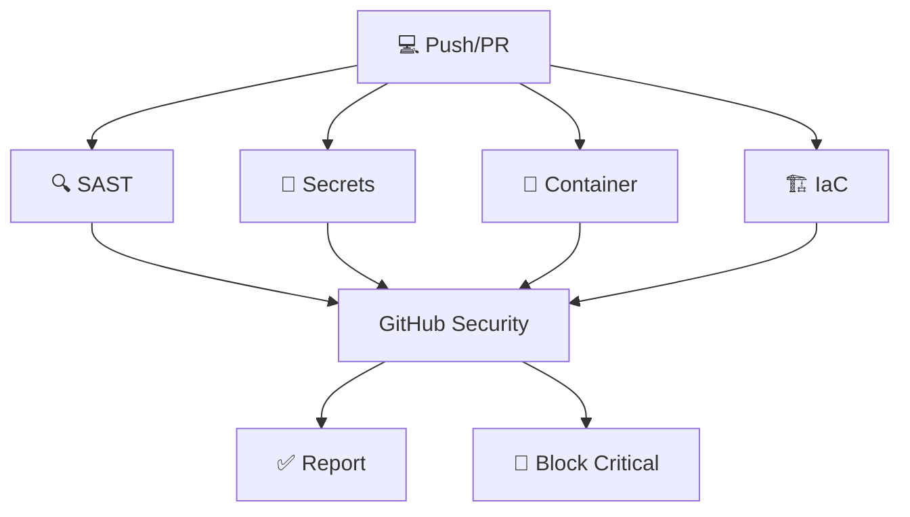

# 🛡️ Esteira de Segurança Automatizada - DevSecOps

<div align="center">


**Uma implementação completa de DevSecOps com análise automatizada de segurança**

[📖 Documentação](#-documentação) • [🔒 Segurança](#-ferramentas-de-segurança) • [📊 Pipeline](#-pipeline-de-segurança) • [📈 Relatórios](#-relatórios-e-monitoramento)

</div>

---

## 🎯 **Visão Geral**

Este projeto demonstra uma implementação **robusta e completa** de **DevSecOps** utilizando **GitHub Actions** para automatizar análises de segurança em todas as fases do desenvolvimento. A aplicação de exemplo é uma **API RESTful** construída em **Python/Flask** com foco em práticas de segurança modernas.

### 🏆 **Destaques do Projeto**

- 🔍 **6 ferramentas de segurança** automatizadas (2 SAST + SCA + Secrets + 2 Container/IaC)
- 🚀 **Integração nativa** com GitHub Security
- 🐳 **Container security** com Trivy
- 📦 **Dependências monitoradas** via Dependabot
- 🔐 **Zero secrets** no código-fonte
- ⚡ **Feedback imediato** em Pull Requests

---

## 🎯 **Estratégia DevSecOps**

### 🔄 **Shift-Left Security**
- **Análise contínua** desde o primeiro commit
- **Feedback imediato** em Pull Requests
- **Bloqueio automático** para vulnerabilidades críticas
- **Integração nativa** com ferramentas de desenvolvimento

### 🛡️ **Defense in Depth**
- **Múltiplas camadas** de análise de segurança
- **Diferentes perspectivas** (código, dependências, containers, IaC)
- **Redundância inteligente** (Semgrep + CodeQL para SAST)
- **Cobertura completa** do ciclo de desenvolvimento

---

## 🛠️ **Ferramentas de Segurança**

### 🔍 **SAST (Static Application Security Testing)**

#### Semgrep - Análise Rápida e Específica
```yaml
🟢 Semgrep v1.0
├── 📋 p/security-audit     # Auditoria geral de segurança
├── 🔐 p/secrets           # Detecção de credenciais
├── 🎯 p/owasp-top-ten     # Top 10 OWASP
├── 🐍 p/python            # Específico para Python
├── 🌐 p/flask             # Framework Flask
├── 💾 p/sql-injection     # Prevenção SQL Injection
└── ⚡ p/command-injection  # Prevenção Command Injection
```

#### CodeQL - Análise Semântica Profunda
```yaml
🟢 GitHub CodeQL
├── 🧠 Semantic analysis    # Análise semântica do código
├── 🔍 Data flow tracking  # Rastreamento de fluxo de dados
├── 🎯 Security queries    # Queries de segurança específicas
└── 🐍 Python coverage     # Cobertura Python nativa
```

### 📦 **SCA (Software Composition Analysis)**
```yaml
🟢 Dependabot
├── 🐍 Python packages      # requirements.txt
├── 🐳 Docker images       # Dockerfile
└── ⚙️ GitHub Actions      # workflows
```

### 🔐 **Secrets Scanning**
```yaml
🟢 Gitleaks v8.0
├── 🔍 API keys detection
├── 🔑 SSH keys scanning
├── 🎫 JWT tokens analysis
└── 📄 Certificate validation
```

### 🐳 **Container Security**
```yaml
🟢 Trivy Scanner
├── 🔍 Image vulnerabilities
├── 📦 Package scanning
├── 🐧 OS vulnerabilities
└── 📋 Configuration issues
```

### 🏗️ **IaC Security**
```yaml
🟢 Trivy Config
├── 🐳 Dockerfile analysis
├── ⚙️ Kubernetes configs
├── 🔧 YAML configurations
└── 🛡️ Security policies
```

---

## 🔒 **Pipeline de Segurança**

### 📊 **Fluxo Automatizado**



### ⚙️ **Configuração dos Workflows**

| Workflow | Trigger | Duração | Status |
|----------|---------|---------|---------|
| **Security Scan** | Push/PR | ~3-5min | ✅ Ativo |
| **Dependabot** | Semanal | ~1min | ✅ Ativo |
| **Container Build** | Push/PR | ~2-4min | ✅ Ativo |

### 🎯 **Triggers Automáticos**

- 📤 **Push para `main`**: Análise completa
- 🔄 **Pull Requests**: Verificação delta
- 📅 **Agendado**: Scan semanal completo
- 🚨 **Dependências**: Atualizações automáticas

---

## 📊 **Relatórios e Monitoramento**

### 🎯 **GitHub Security Tab**
Todos os resultados são centralizados em:
- **Security Overview** → Visão geral
- **Code Scanning** → Análise SAST
- **Dependabot** → Vulnerabilidades de dependências
- **Secret Scanning** → Credenciais expostas

### 📈 **Métricas de Segurança**

```yaml
📊 Cobertura Atual:
├── 🎯 SAST Coverage: 100%
├── 📦 SCA Coverage: 100% 
├── 🔐 Secrets Scan: 100%
├── 🐳 Container Scan: 100%
└── 🏗️ IaC Scan: 100%
```

### 🚨 **Alertas e Notificações**

- ⚡ **Feedback imediato** em PRs
- 📧 **Emails automáticos** para vulnerabilidades críticas
- 🔔 **Notificações GitHub** em tempo real
- 📊 **Dashboards** integrados

---

## 📚 **Documentação**

### 📖 **Configurações de Segurança**
- [⚙️ .github/workflows/security.yml](/.github/workflows/security.yml) - Pipeline de segurança
- [🛡️ .github/dependabot.yml](/.github/dependabot.yml) - Configuração Dependabot

### 🎓 **Recursos de Aprendizado**
- [📚 OWASP DevSecOps Guidelines](https://github.com/OWASP/DevSecOpsGuideline)
- [🔍 Semgrep Rules Documentation](https://semgrep.dev/docs/)
- [🛡️ Trivy Security Scanner](https://trivy.dev/)
- [🔒 GitHub Security Features](https://docs.github.com/en/code-security)

---

## 🛡️ **Práticas de Segurança Implementadas**

### ✅ **Implementado**
- [x] 🔍 Análise estática de código - SAST (Semgrep + CodeQL)
- [x] 📦 Análise de dependências - SCA (Dependabot + Trivy)
- [x] 🔐 Detecção de secrets (Gitleaks)
- [x] 🐳 Segurança de containers (Trivy)
- [x] 🏗️ Infrastructure as Code scanning (Trivy Config)
- [x] 🚨 Bloqueio automático para vulnerabilidades críticas
- [x] 📊 Integração com GitHub Security
- [x] 🔄 Monitoramento contínuo

### 🔄 **Roadmap Futuro**
- [ ] 🌐 DAST (Dynamic Application Security Testing) - OWASP ZAP
- [ ] 🎯 IAST (Interactive Application Security Testing)
- [ ] 🤖 AI-powered security analysis
- [ ] 📊 Custom security dashboards
- [ ] 🔧 Auto-remediation workflows

---

## 🤝 **Contribuição**

Contribuições são bem-vindas! Por favor:

1. 🍴 **Fork** o projeto
2. 🌿 **Crie** uma branch (`git checkout -b feature/amazing-security`)
3. ✅ **Commit** suas mudanças (`git commit -m 'Add amazing security feature'`)
4. 📤 **Push** para a branch (`git push origin feature/amazing-security`)
5. 🔄 **Abra** um Pull Request

---

## 📜 **Licença**

Este projeto está licenciado sob a [MIT License](LICENSE). 

---

## 🏷️ **Tags**

`devsecops` `security` `automation` `github-actions` `python` `flask` `docker` `sast` `sca` `semgrep` `trivy` `gitleaks` `dependabot`

---

<div align="center">

**Desenvolvido com ❤️ para demonstrar as melhores práticas de DevSecOps**

⭐ **Se este projeto foi útil, considere dar uma estrela!** ⭐

</div>